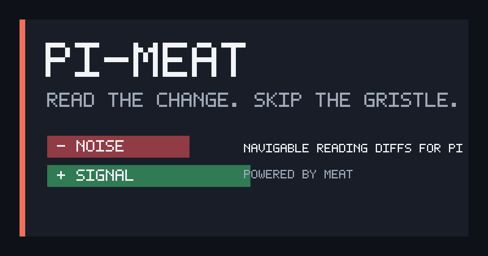
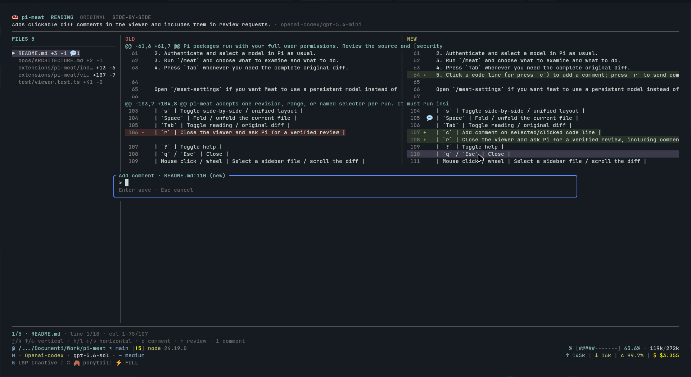

<div align="center">

# 🥩 pi-meat

### Read the change. Skip the gristle

Navigable reading diffs for [Pi](https://pi.dev), powered by [Meat](https://meat.dev) and your existing Pi model.

[](https://github.com/arro000/pi-meat/actions/workflows/ci.yml)
[](https://www.npmjs.com/package/@andreaarrighi/pi-meat)
[](LICENSE)





</div>

pi-meat opens the original Git diff immediately while it builds a smaller reading diff in the same navigable terminal viewer. It uses the model already authenticated in Pi: no second provider account or API key is required.

- Move directly between changed files.
- Switch between reading and original diffs at any time.
- Use unified or synchronized side-by-side panes.
- Hand the result back to Pi for a verification-oriented review.

> A reading diff reduces noise; it does not prove correctness. Verify findings against the original diff and repository source.

## Requirements

- [Pi](https://pi.dev) interactive TUI
- Node.js 24+
- Go 1.24.13+
- Git

Go is currently required because the package ships the bridge source and falls back to `go run`. Prebuilt bridge binaries are planned.

## Install

Install the latest npm release:

```bash
pi install npm:@andreaarrighi/pi-meat
```

Try it without a persistent install:

```bash
pi -e npm:@andreaarrighi/pi-meat
```

Pin a release or install tagged Git source:

```bash
pi install npm:@andreaarrighi/pi-meat@0.1.0
pi install git:github.com/arro000/pi-meat@v0.1.0
```

Pi packages run with your full user permissions. Review the source and [security policy](SECURITY.md) before installation.

## Quick start

1. Start Pi inside a Git repository.
2. Authenticate and select a model in Pi as usual.
3. Run `/meat-settings` to set Meat's persistent model, thinking level, and startup mode.
4. Run `/meat` and choose what to examine and what to do. The original diff opens immediately.
5. In `default` startup mode, Meat starts immediately. In `on-demand` mode, press `Tab` to open Reading and `Enter` to start Meat.
6. Click a code line (or press `c`), type the comment in the overlaid dialog, and press `Enter`; click a marked line to read or edit its comment, then press `r` to send comments with the review request to Pi.

## Choose changes

Running `/meat` without arguments opens an interactive menu. First choose what to examine:

- Latest commit (`HEAD`)
- Staged changes
- Unstaged changes
- All local changes
- A commit range, such as `v1.2.0..HEAD`
- Current branch compared with `main` (`main...HEAD`)
- A custom revision or range

Then choose whether to explore the reading diff or review the changes with Pi. The menu requires Pi's interactive TUI.

CLI shortcuts remain available:

| Command | Changes opened |
| --- | --- |
| `/meat <revision>` | Specific commit |
| `/meat main...HEAD` | Revision or branch range |
| `/meat staged` | Staged changes |
| `/meat worktree` | Unstaged changes |
| `/meat w` | Short alias for `worktree` |
| `/meat all` | Staged and unstaged changes |
| `/meat HEAD --fresh` | Ignore the matching cached result and create a new one |

pi-meat accepts one revision, range, or named selector per run. It must run inside a Git repository.

## Viewer controls

| Key | Action |
| --- | --- |
| `j` / `k`, `↑` / `↓` | Scroll vertically |
| `h` / `l`, `←` / `→` | Scroll source horizontally |
| `PgUp` / `PgDn`, `Home` / `End` | Page or jump through the current file |
| `n` / `p` | Next / previous changed file |
| `s` | Toggle side-by-side / unified layout |
| `Space` | Fold / unfold the current file |
| `Tab` | Toggle reading / original diff; the status line below the modes remains visible throughout generation |
| `Enter` | Start Meat from the Reading view when startup mode is `on-demand` |
| `c` | Add or edit the selected line's comment (`Enter` saves, empty input deletes, `Esc` cancels) |
| `r` | Close the viewer and ask Pi for a verified review, including comments |
| `?` | Toggle help |
| `q` / `Esc` | Close |
| Mouse hover / click / wheel | Highlight a code line, select a sidebar file, add/edit a line comment, or scroll the diff |
| Horizontal wheel / `Shift` + wheel | Scroll horizontally when supported by the terminal |

Wide terminals show a file sidebar and old/new panes. Commented files show a `💬` count, and commented lines show `💬` beside the diff marker. Medium terminals keep full-width side-by-side panes; narrow terminals switch to unified layout. Hold `Shift` for terminal-native text selection while mouse reporting is active.

## Model settings

By default, Meat uses Pi's active model and thinking level. `/meat-settings`, `/meat settings`, or `Ctrl+Shift+M` configures an independent persistent model, model-supported thinking level, and startup mode without changing Pi's active settings.

Startup mode is `default` unless changed:

- `default`: Meat starts when the diff viewer opens.
- `on-demand`: the original diff opens without starting Meat; switch to Reading and press `Enter` when you want to generate it.

The viewer always shows Meat's state directly below the Reading/Original choices. When the reading diff is ready, `✨` appears beside Reading. Cached reading diffs are ready immediately and do not require another run.

Settings are stored in `~/.pi/agent/pi-meat.json`. Cache entries are separated by model and effective thinking level. Set `PI_MEAT_SETTINGS` to use another path.

## Local data and privacy

The selected diff is sent to the model provider configured in Pi. pi-meat does not enable repository read or grep tools for abridgement, and it adds no independent telemetry.

Original and reading diffs are cached as plaintext under `~/.pi/agent/cache/pi-meat/` with no automatic expiry. Delete the default cache with:

```bash
rm -rf ~/.pi/agent/cache/pi-meat
```

Set `PI_MEAT_CACHE` to choose another cache directory. See [privacy and data flow](docs/PRIVACY.md) for stored fields, permissions, credentials, retention, and provider boundaries.

## Troubleshooting

| Problem | Action |
| --- | --- |
| `pi-meat currently requires Pi's interactive TUI` | Start a regular interactive Pi session. |
| `pi-meat must run inside a Git repository` | Start Pi from the repository or one of its subdirectories. |
| `No changes found` | Check the selected revision or use `staged`, `worktree`, or `all`. |
| Configured model is unavailable | Run `/meat-settings` and select an authenticated model. |
| Bridge startup or Go module error | Confirm Go 1.24.13+ is installed and can download the pinned modules. The first run may be slower. |
| Stale reading diff | Run the same selector with `--fresh`. |

For unresolved problems, follow the [support guide](SUPPORT.md).

## Status

`0.1.x` is an early public release. Commands, cache layout, and bridge protocol may change before `1.0.0`.

## Reference

- [Architecture](docs/ARCHITECTURE.md): components, model bridge, protocol, and trust boundaries.
- [Privacy](docs/PRIVACY.md): provider data, local artifacts, credentials, and deletion.
- [Contributing](CONTRIBUTING.md): development setup, tests, and pull requests.
- [Releasing](docs/RELEASING.md): maintainer publishing and Pi catalog procedure.
- [Changelog](CHANGELOG.md) and [roadmap](PLAN.md): current status and planned work.

pi-meat is an independent integration. It is not affiliated with or endorsed by Pi maintainers or Bold Software, Inc. Meat attribution is provided in [NOTICE](NOTICE); naming and visual guidance live in the [brand guide](docs/BRAND.md).

[Apache-2.0](LICENSE) © 2026 arro000
